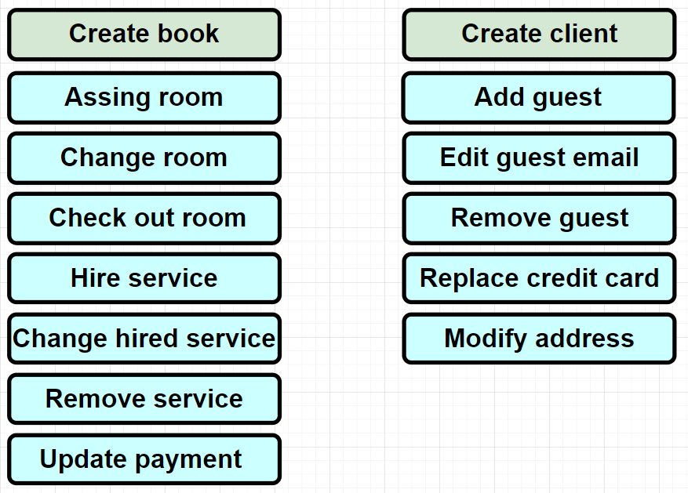

# SofkaU Training League - DDD Challenge.

## Description 
This project uses Domain Driven Design (DDD) architecture to design and develop a reservation management system for CITYhotel's lobby. DDD focuses on modeling objects and processes within a specific domain, which makes it ideal for hotel reservation management.

The main objective of the project is to provide an easy-to-use and efficient reservation management system for hotel lobby employees. The system allows the lobby to easily make and manage reservations.

The project uses modern technologies and development tools to ensure code quality and system efficiency. It is built using Java programming language with SpringBoot.

 

## Big Picture - Domain & Subdomains
The following image shows the big picture of the domain, where you can see the different subdomains with their respective nature. It also shows different solutions proposed for different scenarios within the domain, highlighting the solution chosen for this project, Booking App.

 

## Bounded Context
Paying specific attention to the selected solution, in the following image the bounded context is defined, where there are two aggregates, Booking and Client, which are the respective aggregate root, with their respective proposed entities.  

 

## Ubiquitous Language
Continuing with the definition of the project, the following image shows the building blocks with the ubiquitous language proposed for the different functionalities, later it will be possible to observe the ubiquitous language in the model desing in depth.

 

## Domain Model
The following image represents the domain model, where the root aggregates [AR], the entities [E] and the value objects [VO] necessary for the construction of the project are observed. It should also be noted that there is a customer/supplier relationship, where the booking aggregate receives information from the customer.  

 

## Command Driven Use Cases
A total of 10 command driven use cases of the proposed functionalities were developed.

The following were developed for the case of the client aggregate:
* CreateClientUseCase - Create a client
* AddGuestUseCase - Add a guest to the client
* EditGuestEmailUseCase - Edit the guest email
* RemoveGuestUseCase - Allows to remove a guest from the client
* ReplaceCreditCardUseCase - Allows to replace the client credit card
* ModifyAddresUseCase - Allows to modify the client address

The following were developed for the case of the booking aggregate:
* CreateBookingUseCase - Create a booking
* AssingRoomUseCase - Allows to assign rooms to a booking
* CheckOutRoomUseCase - Allows to remove a room from a booking
* HireServiceUseCase - Allow to hire diferents sevices

 

## Event Driven Use Cases
Two event driven use cases were developed, which are automatically triggered when an event is received, these were developed specifically for the booking aggregate:
* CheckInRoomUseCase - Trigered when assing a room and change the availability of the room to unavailable
* FreeUpRoomUseCase - Trigered when check out a room and change the availability of the room to available

 

## Authors
By Larry Mateo Ramirez C.